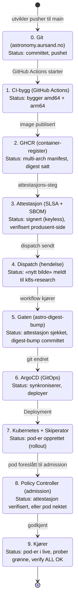

# Flyten forklart: fra `git push` til trygt deployet i Kubernetes

*En pedagogisk gjennomgang av hele kjeden i dette prosjektet. Skrevet for utviklere som kan git og kode, men ikke nødvendigvis CI/CD, SLSA eller Kubernetes. Hvert steg introduserer konseptene én om gangen.*

> Du trenger ikke vite hvordan alt virker for å lese dette. Du trenger heller ikke lese alt. De syv delene er lagt opp slik at du kan stoppe når du vil:
> 1. **TL;DR**: historien i ett avsnitt
> 2. **Det store bildet**: ett diagram
> 3. **Reisen**: steg for steg, med den ekte E2E-pushen som eksempel
> 4. **Trussel-modellen**: hva hvert «lås» beskytter mot
> 5. **Ordliste**: begrepene på én setning
> 6. **Vanlige misforståelser**
> 7. **Videre lesing**

---

## 1. TL;DR: historien i ett avsnitt

En utvikler pusher en endring til `main` i et GitHub-repo. GitHub Actions bygger programmet som et *container-bilde*, beregner bildeets *fingeravtrykk* (digest), og signerer en *ekthetsattest* som sier «dette bildet er bygget av denne byggetjenesten, fra akkurat denne koden» (SLSA-provenance). En robot i et annet repo sjekker at attestasjonen finnes før den oppdaterer «hvilket bilde appen skal kjøre». ArgoCD (GitOps) ser at git har endret seg og setter i gang en deploy. Sist, men viktigst: Kubernetes' egen *dørvakt* (Sigstore Policy Controller) verifiserer signaturen på nytt før pod-en får starte. Hvis noen av kontrollene feiler, skjer ingenting: fail-closed.

Alt dette skjer automatisk hver gang noen pusher. Utvikleren trenger ikke gjøre noe.

---

## 2. Det store bildet

```
[1] Utvikler pusher til main (astronomy.aursand.no)
      │
      ▼
[2] GitHub Actions bygger multi-arch bilde  (amd64 + arm64)
      │  ► beregner digest (fingeravtrykk)
      ▼
[3] Attesterer bildet: SLSA-provenance + SBOM, signert av GitHub (keyless)
      │  ► verifiserer produsent-side
      ▼
[4] Dispatcher «nytt bilde» til GitOps-repoet (k8s-research)
      │
      ▼
[5] GATE: sjekker at en SLSA-attestasjon finnes for digest-en  →  committer bump
      │
      ▼
[6] ArgoCD (GitOps) ser git-endringen og deployer til Kubernetes
      │
      ▼
[7] POLICY CONTROLLER: verifiserer attestasjonen ved admission  →  pod starter (eller nektes)
      │
      ▼
[8] Rollout + helsesjekker → appen kjører trygt
```

**Analogien:** forestill deg at du sender en verdifull pakke.
- **Digest** = pakkens fingeravtrykk (én pakke ↔ ett fingeravtrykk).
- **Attestasjonen** = et notarisert dokument: «denne pakken ble pakket av GitHub fra akkurat dette innholdet».
- **Gaten (steg 5)** = tollen som sjekker at dokumentet finnes.
- **Policy Controller (steg 7)** = dørvakten som også leser og verifiserer dokumentet før pakken får komme inn i huset.
- **GitOps/ArgoCD (steg 6)** = arbeideren som hele tiden sjekker at huset matcher blåkopien (git).

### De involverte verktøyene (rollekart)

Før vi følger reisen: her er alle verktøyene som er involvert og hvilken rolle de har. Du trenger ikke huske alt: bruk tabellen som oppslag når et navn dukker opp i stegene.

**Verts- og kode-laget**

| Verktøy | Hva det er | Rolle i flyten |
|---|---|---|
| Git | Versjonskontroll | Historikken over endringer; «kilden til sannhet» (steg 0, 6) |
| GitHub | Plattform som hoster repoer | Repoene, PR-er, attestasjons-API (overalt) |
| GitHub Actions | CI/CD-tjeneste | Bygger, tester, attesterer og dispatcher (steg 1–4) |
| GitHub-hosted runners | Byggemaskinene Actions kjører på | Isolerte byggemiljøer som GitHub administrerer (steg 1) |
| Dependabot | Automatisk avhengighets-oppdaterer | Foreslår oppdateringer (avhengigheter + actions) som reviewbare PR-er |
| GHCR | Container-register | Lagrer bildene og attestasjonene (steg 2–3) |
| Sigstore/cosign | Signerings-verktøy (keyless) | Lager og verifiserer ekthetsattestene (steg 3, 8) |

**Lokalt-kluster-laget (kind)**

| Verktøy | Hva det er | Rolle i flyten |
|---|---|---|
| kind | Kubernetes-i-Docker | Kjører et lite k8s-kluster på Mac-en: selve testmiljøet |
| Kubernetes (k8s) | Container-orkestrerer | Kjører og holder appen i live (steg 6–9) |
| Skiperator | Operator | Oversetter enkle app-beskrivelser til fullt k8s-oppsett (steg 7) |
| Istio | Service mesh | Nettverk, TLS og trafikk mellom tjenester |
| cert-manager | Sertifikat-utsteder | Lager/fornyer TLS-sertifikater automatisk |
| MetalLB | Lokal LoadBalancer | Gir klusteret en «ekstern» IP (via nip.io) |
| metrics-server | Metrikk-API | Måler CPU/minne → autoskalering |

**GitOps- og sikkerhets-laget**

| Verktøy | Hva det er | Rolle i flyten |
|---|---|---|
| ArgoCD | GitOps-motor | Holder klusteret likt git; auto-sync + self-heal (steg 6) |
| Sigstore Policy Controller | Admission-controller | Dørvakten som verifiserer attestasjonen før pod-en starter (steg 8) |
| GitHub trust-policies | Policy-definisjon | Gir TrustRoot + ClusterImagePolicy som håndheves av Policy Controller (steg 8) |

---

## 3. Reisen: steg for steg

Vi følger **én ekte push** (`7437db6` i astronomy-repoet) gjennom hele kjeden. Alle stegene er verifisert end-to-end i dette prosjektet.

### Appens reise (hvor er appen, og hvilken status?)

Diagrammet viser applikasjonens sted og status i hvert steg. Pilene er det som «flytter» den videre.



### Steg 0: git og «push til main»

Git er et versjonskontrollsystem: en historie over endringer i tekstfiler. `main` er hovedgrenen («den versjonen som gjelder»). Å pushe betyr å laste opp endringene til GitHub, slik at alle (og alle automatiserte systemer) kan se dem.

Et GitHub-**repo** er bare en mappe med git-historikk pluss en haug med automatiseringsverktøy. Dette prosjektet har to repoer som samarbeider:
- `astronomy.aursand.no`: selve appen (et astronomi-API).
- `k8s-research`: beskrivelsen av hvordan appen skal kjøre i Kubernetes (GitOps-kilden).

### Steg 1: CI-bygg (GitHub Actions)

**CI** = Continuous Integration: automatisert bygging og testing av hver endring. **GitHub Actions** er GitHub sin CI/CD-tjeneste: du skriver en *workflow* (en YAML-fil) som beskriver hva som skal skje når noe pusher.

For astronomy er build-jobben en **matrise**: den bygger bildeet to ganger, én for `amd64` (x86) og én for `arm64` (Apple Silicon/ARM). Deretter slår en merge-job de to sammen til ett multi-arch *manifest* («ett bilde som virker på begge arkitekturene»). Bygge- og merge-jobben er **reusable workflows** i biblioteket `toreau/gh-workflows` (kalt med `@v1`); repoene holder bare tynne kallere.

**Hva er et container-bilde?** En pakke med programmet + alt det trenger (runtime, biblioteker), slik at det kjører likt overalt. Docker og Kubernetes bruker slike bilder.

### Steg 2: Artefakten og digest

Et container-bilde har en adresse (`ghcr.io/toreau/astronomy-api`) og en **digest**: `sha256:a7536683f9…`. Digest-en er en kryptografisk hash av bildeinnholdet, praktisk talt et unikt fingeravtrykk. Én digest ↔ nøyaktig ett innhold. Hvis noen endrer bildet på noen som helst måte, blir digest-en annerledes.

Derfor er digest-en så viktig: den lar oss snakke om *nøyaktig dette bildet*, ikke «et bilde som heter latest» (som kan endres når som helst).

### Steg 3: Attestasjon og SBOM (SLSA, keyless, OIDC)

**SLSA** = Supply-chain Levels for Software Artifacts. Det er et rammeverk (laget av Google, nå open source) som graderer hvor sikker leveringskjeden til et program er. Kjernen: hvert bilde skal ha en *provenance*: en attestasjon som dokumenterer **hva som ble bygget, av hvilken byggetjeneste, fra hvilken kilde**.

I dette prosjektet lager build-workflowen:
- **SLSA build-provenance**: «dette bildet ble bygget i GitHub Actions fra commit `7437db6`».
- **SBOM** (Software Bill of Materials): en liste over alle avhengighetene i bildet.

Begge signeres og lastes opp til både container-registreret (GHCR) og GitHub sitt attestasjons-API.

**Hvordan signeres det uten private nøkler (keyless)?** Tradisjonelt måtte byggeren ha en hemmelig signeringsnøkkel. Med **OIDC** (OpenID Connect) gjør GitHub det slik: byggetjenesten viser «myndighetenes ID» (GitHub sin identitet) og beviser at det faktisk er GitHub som kjører denne workflowen. GitHub signerer deretter attestasjonen med sin egen nøkkel. Det kalles *keyless signing*: vi trenger ikke lagre eller rotere en nøkkel selv; GitHub vokter den.

Attestasjonen lages i den gjenbrukbare workflow-en `container-merge-attest` (i `toreau/gh-workflows`): signer-identiteten er derfor `…/container-merge-attest.yml@refs/tags/v1`, ikke `ci.yml`.

Før dispatch **verifiserer workflowen sin egen attestasjon** (`gh attestation verify`), et «double-check» før noe sendes videre.

> **SLSA-nivåene:** speket graderer 0–4. Med GitHub Actions + signert provenance har vi oppnådd **Build-nivå 2 fullt, nivå 3 i praksis** (mangler bl.a. branch-protection/to-person-review på `main`). Nivå 4 (hermetiske, reproduserbare bygg) er ikke nådd. «SLSA-4/5» i arbeidsloggene er *våre* etiketter for håndheving/verifisering, ikke speknivåer.

### Steg 4: Dispatch («det finnes et nytt bilde»)

`astronomy`-repoet må fortelle `k8s-research`-repoet at det finnes et nytt bilde. Det gjøres med en **repository_dispatch**: en GitHub-hendelse der ett repo kan trigge en workflow i et annet. Meldingen inneholder commit-SHA-en og den nye digest-en.

### Steg 5: Gaten («skal vi stole på denne digest-en?»)

I `k8s-research` finnes en workflow (`astro-digest-bump.yml`, en tynn kaller av reusable workflow-ene `attestation-gate` → `digest-bump`) som lytter etter dispatchen. Før den endrer noe, spør den GitHub sitt attestasjons-API: «finnes det en SLSA-attestasjon for `sha256:a7536683…`?». Hvis ikke, ingen oppdatering. Hvis ja, den oppdaterer én linje i en YAML-fil (hvilket bilde appen skal kjøre) og committer.

**Vær ærlig om hva gaten gjør:** den sjekker at en attestasjon *finnes* med riktig type (SLSA-provenance). Den verifiserer ikke signaturen kryptografisk selv. Det er en *lett* kontroll som hindrer at uattesterte digester i det hele tatt kommer inn i git. Den sterke verifiseringen skjer to steder:
- **produsent-siden** (steg 3): `gh attestation verify` under byggingen, og
- **in-kluster** (steg 8): Policy Controller, som verifiserer signaturen grundig før pod-en starter.

Dette er en bevisst arbeidsdeling, og et godt eksempel på at man må vite *hvilket* lag som faktisk beskytter deg.

### Steg 6: GitOps og ArgoCD

**GitOps** er en måte å drive deploy på: *git er kilden til sannhet*. Alt som skal kjøre i klusteret er beskrevet som filer i git. **ArgoCD** er en «arbeider» som kjører inne i klusteret, ser på git, og hele tiden passer på at virkeligheten matcher beskrivelsen. Hvis noen manuelt endrer noe i klusteret, retter ArgoCD det opp igjen (self-heal). Hvis git endres, deployer ArgoCD (auto-sync).

I dette prosjektet bruker ArgoCD *app-of-apps*: en hoved-app som administrerer flere under-apper, hver med sin mappe i git (én for astronomy, én for observability, osv.).

### Steg 7: Kubernetes og Skiperator

**Kubernetes (k8s)** er et system for å kjøre container-bilder på en robust måte: det starter pod-er (minste enhet = en eller flere containere), holder dem i live, skalerer og håndterer nettverk/lagring. Å skrive Kubernetes-manifester direkte er mye jobb (Deployment, Service, nettverksregler, sertifikater, autoskalering…).

**Skiperator** er en *operator*: et program inne i klusteret som skjønner enkle, høynivå-beskrivelser (CR-er, Custom Resources) og oversetter dem til all boilerplate. Du skriver «jeg vil ha denne appen, på denne porten, med denne URL-en», og operatøren lager Deployment, Service, Istio-nettverk, sertifikat, autoskalering og nettverks-policyer selv.

### Steg 8: Sigstore Policy Controller (den siste dørvakten)

**Sigstore Policy Controller** er en admission-controller for attestasjoner. Den har en **admission webhook**: før Kubernetes lar en ny pod starte, blir den spurt «får denne pod-en starte?». Sammen med GitHub-`trust-policies`-chartet håndhever den en **ClusterImagePolicy** som sier: «for bilder med navn `ghcr.io/toreau/astronomy-api*` krever jeg en gyldig SLSA-attestasjon signert av `container-merge-attest`-workflow-en (keyless; subject-identiteten matcher `…/container-merge-attest.yml@refs/tags/v1`)». Istio-bildene (`proxyv2`) er unntatt.

Hvis attestasjonen er borte, ugyldig eller signert av noen andre → pod-en **nektes** å starte. Dette er **fail-closed**: når i tvil, slipp inn ingenting.

> Dette var testen på om hele kjeden virkelig er trygg: vi prøvde å starte en pod med et bilde som manglet attestasjon, og Policy Controller blokkerte den. Positiv test: et attestert bilde startet fint.

### Steg 9: Rollout og verifisering

Når pod-en starter, sjekker Kubernetes helsetilstanden med *probes* (`/health/live`, `/health/ready`). Til slutt kjører en liten smoke-test (`make astronomy-verify`) som verifiserer at alt faktisk virker: ArgoCD synkronisert, databasen svarer, appen kjører, helse-endepunktet er grønt og solposisjonen kan beregnes.

---

## 4. Trussel-modellen: hva hvert «lås» beskytter mot

| Trussel | Hva kunne skjedd | Forsvar | Hvor |
|---|---|---|---|
| Ondsinnet/kompromittert byggetrinn | En «snok» i build-workflowen bygger et bilde med bakdør | CI i GitHub Actions (hostet), actions pinnet ved SHA | steg 1–2 |
| Tuklet bilde under transport/lagring | Noen endrer bildet i registeret etter bygging | Digest-en endres → attestasjonen matcher ikke lenger | steg 2–3 |
| Uattestert/forfalsket bilde slippes inn i git | En digest uten attestasjon committes | Gaten (lett sjekk) | steg 5 |
| Angriper deployer et ondsinnet bilde direkte | En pod med uattestert bilde starter | Sigstore Policy Controller (sterk, fail-closed) | steg 8 |
| Drift/urautorisert endring i klusteret | Noen endrer deployet manuelt | ArgoCD self-heal reverserer | steg 6 |
| Urevidert kode i produksjon | Direkte push med dårlig/ond kode | (ikke løst ennå: mangler branch-protection/to-person-review) | steg 0 |

---

## 5. Ordliste

- **Artifact**: et bygget produkt (her: container-bildet).
- **Digest**: kryptografisk fingeravtrykk av et bilde (`sha256:…`).
- **Manifest (multi-arch)**: en liste over arkitektur-variantene av ett bilde.
- **CI/CD**: automatisert bygging/testing (CI) og levering/deploy (CD).
- **Workflow**: en YAML-beskrivelse av automatiske trinn i GitHub Actions.
- **SBOM**: liste over alle avhengigheter i et produkt.
- **Attestasjon / provenance**: signert bevis på «hva ble bygget, av hvem, fra hvilken kilde».
- **SLSA**: rammeverk som graderer sikkerheten i leveringskjeden (0–4).
- **OIDC / keyless**: GitHub signerer på vegne av byggetjenesten, uten at vi forvalter en nøkkel.
- **Digest-bump**: endre «hvilken digest appen skal kjøre» i git.
- **GitOps**: git som kilden til sannhet for deploy.
- **ArgoCD**: verktøyet som holder klusteret likt git (auto-sync, self-heal).
- **App-of-apps**: én ArgoCD-app som administrerer andre apper.
- **Kubernetes (k8s)**: system for å kjøre container-bilder.
- **Pod**: minste kjørende enhet i Kubernetes (en eller flere containere).
- **Operator**: program i klusteret som forvalter en type ressurs (Skiperator).
- **CR/CRD**: høy-nivå beskrivelse (Custom Resource) og definisjonen av den.
- **Admission webhook**: et «sjekkpunkt» før Kubernetes tillater en ressurs.
- **ClusterImagePolicy**: regelen Policy Controller håndhever (her: SLSA-attestasjon på `astronomy-api`-bilder).
- **TrustRoot**: klusterets tillitsanker for signeringsnøklene (her: GitHub-trust-roten).
- **Fail-closed**: «når i tvil, nekt».
- **Probe**: helsesjekk Kubernetes kjører mot en pod.

---

## 6. Vanlige misforståelser

- **«Gaten verifiserer attestasjonen kryptografisk»**: nei. Gaten er en lett sjekk (attestasjonen finnes + riktig type). Den sterke verifiseringen ligger produsent-side og i Policy Controller.
- **«Prod er også beskyttet av hele kjeden»**: delvis. Kind-klusteret (dette prosjektet) er fullt beskyttet. Produksjonstjenesten (Coolify) bygger fra git uten attestasjons-kontroll; dette er et forsknings-/læringsoppsett.
- **«Digest er det samme som tag»**: nei. En tag (`latest`) er en flyttbar etikett; en digest peker på nøyaktig ett innhold.
- **«Vi har SLSA-nivå 5»**: speket går bare til 4. Vår kjede (attest → gate → Policy Controller) er mer enn mange har, men formelt er det Build L2–L3.
- **«Hvorfor er repoet public?»**: GitHub artifact attestations krever public repo (eller Enterprise). Public er en forutsetning for denne løsningen.

---

## 7. Videre lesing

- **Kort:** `README.md` i dette repoet (arkitektur + kommandoer).
- **Medium:** k8s-manualen (norsk, reproduksjon) i Docmost; `Services/astronomy`.
- **Dypt:** `Projects/k8s-research` + `Decisions & gotchas` i Docmost; arbeidslogger (Phase 0 → SLSA-5); SLSA-spesifikasjonen på slsa.dev; GitHub-dokumentasjonen for artifact attestations.

---

*Dokumentet er skrevet 2026-08-26 for å forklare hele flyten i dette prosjektet. Tallene og SHA-ene er fra den faktiske end-to-end-verifiseringen (`7437db6` → `a7536683` → `a4abbf6` → Policy Controller-admission).*
